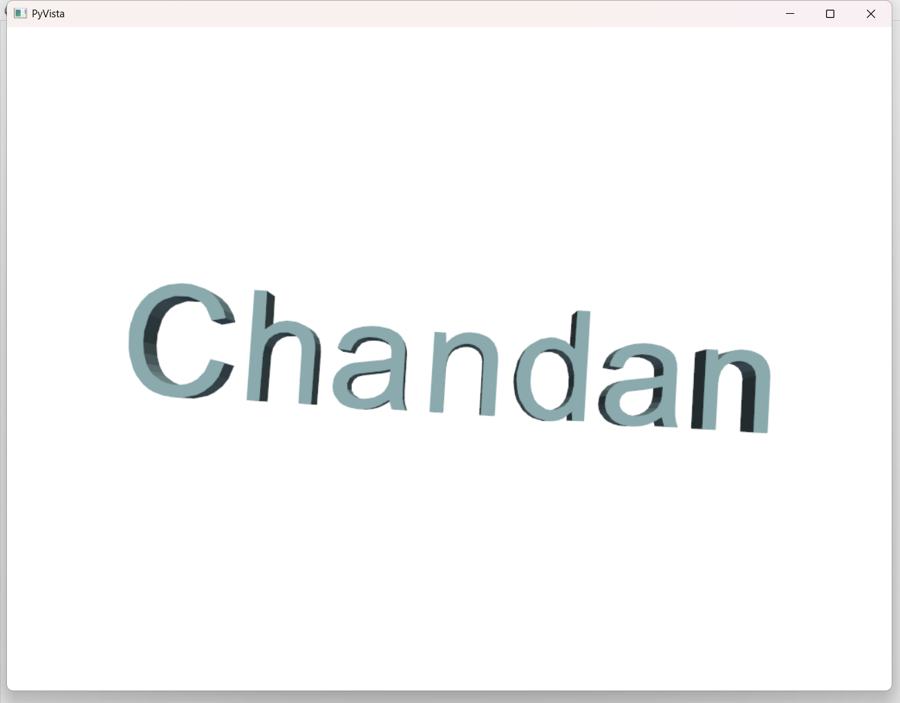

# 🌀 3D Text Generator in Python

This is a Python desktop application that takes input Text from a GUI and generates a 3D Text model of the text using `tkinter`, `messagebox`, `fielddialog`, `numpy`, `pyvista`, `traceback` 

## 💡 Features

- Tkinter- GUI based for user input
- Converts text into 2D vector paths
- Extrudes 2D paths into 3D meshes
- Visualizes 3D text using Open3D
- Random coloring per character

## 📦 Dependencies

Install the required libraries using pip:

```bash
pip install tkiter numpy pyvista traceback open3d


##  Screenshot



# Author
Chandan